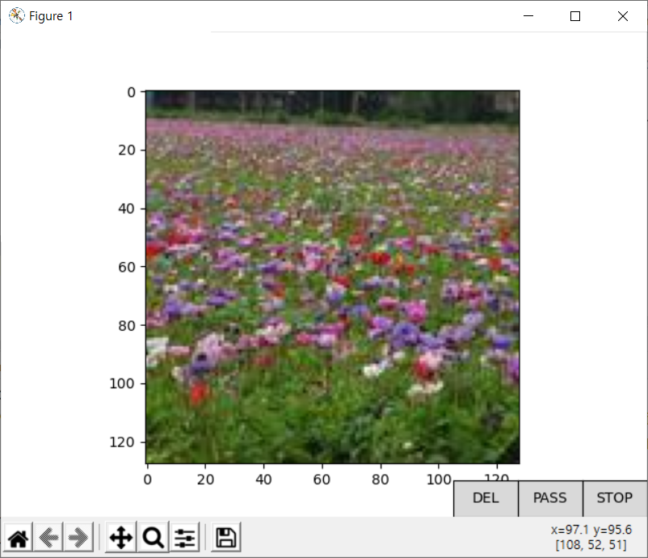

## flickr-dataset

**Simple** python script for downloading massive images from flickr.

### Functions

- Download images by keyword from flickr (command: `download`).
- View individual images with matplotlib, delete image by plot button (command: `check`).

### How to use

#### Setup python environment

1. Clone this repository and setup virtual python environment.
1. Install packages with pip.
    ```
    pip install -r requirements.txt
    ```
1. Copy `config.example.json` as `config.json` and fill out with your Flickr API Keys.

#### Download images massively

```
python main.py download --keyword "kitten" --sp 1 --ep 5
```

There are three major parameters.

- keyword: keyword to search
- sp: start page
- ep: end page

approx. (ep - sp + 1) * 100 images will be downloaded.

Size of the image is (128, 128). 
If you want to download images in bigger size,
check parameter `size` of `FlickrDownloader.download` method.

#### Check images one by one

```
python main.py check --keyword "kitten"
```

The window (with matplotlib) will show up,
and images located in `tmp_kitten` will be shown on the window one by one.

There are three buttons available.



- "DEL" will mark the current image to be deleted and show the next image.
- "PASS" will show the next image.
- "STOP" will close the window, and delete all marked images.
