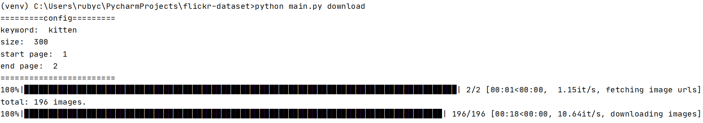
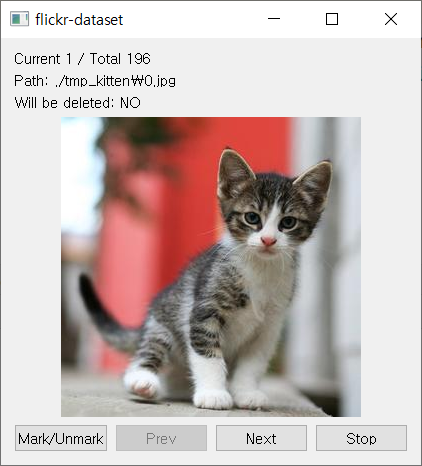

**[WARNING]**

- This repository is now archived.
- Please check the Kotlin implementation, [FlickrDataset](https://github.com/rubycho/FlickrDataset/).

## flickr-dataset

**Simple** python script for downloading massive images from flickr.

### Functions

- Download images by keyword from flickr (command: `download`).
- View individual images, select images to delete (command: `check`).

### How to use

#### Setup python environment

1. Clone this repository and setup virtual python environment.
1. Install packages with pip.
    ```
    pip install -r requirements.txt
    ```
1. Copy `config.example.json` as `config.json` and fill out.

#### Configuration File

```json
{
  "API_KEY": "[YOUR FLICKR API KEY]",
  "API_SECRET": "[YOUR FLICKR SECRET KEY]",
  "KEYWORD": "kitten",
  "SIZE": 128,
  "START_PAGE": 1,
  "END_PAGE": 10
}
```

The SIZE should be bigger than or equal to 128,
smaller than or equal to 640.

#### Download images massively

```
python main.py download
```

approx. (END_PAGE - START_PAGE + 1) * 100 images will be downloaded.



#### Check images one by one

```
python main.py check
```

The Qt window will show up,
and images located in `tmp_{KEYWORD}` will be shown on the window one by one.

There are four buttons available.



- Mark/Unmark: Mark or Unmark image.
- Prev: Show previous image.
- Next: Show next image.
- Stop: Stop, and remove all marked images.
